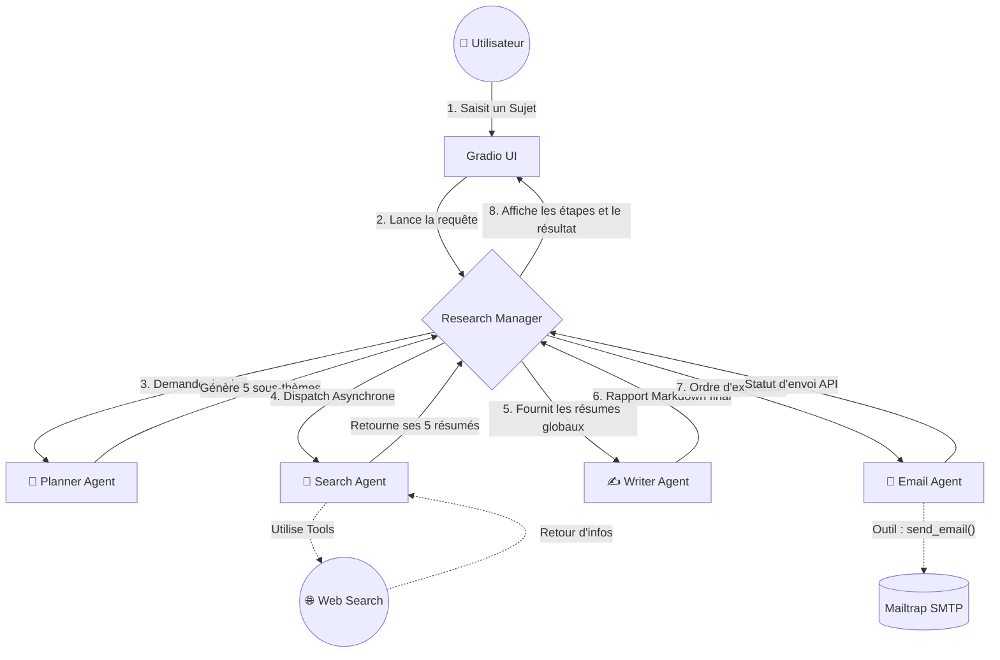

# Architecture : Deep Research Multi-Agents

Ce document présente l'architecture du projet `deep_research-agent`. Ce système met en place une orchestration sophistiquée à plusieurs agents AI autonomes pour automatiser de bout en bout un processus de recherche approfondie sur Internet.

## 📊 1. Modèle d'Architecture Globale (Workflow)

L'orchestration du travail est pilotée par le composant principal `ResearchManager`. Voici comment l'information transite entre l'utilisateur et les différents agents de votre système :

---

## 2. Rôles et Responsabilités des Agents

Le projet suit un design pattern de _"Séparation des Responsabilités"_ très net où chaque agent a un rôle spécifique :

| Composant | Fichier source | Outil(s) mis à disposition | Modèle ML  | Rôle métier principal |
| :--- | :--- | :--- | :--- | :--- |
| **Planner Agent** | `planner_agent.py` | _Aucun_ | `gpt-4o-mini` | Analyse le sujet demandé et décompose le problème en listant **5 requêtes de recherche web** accompagnées de leur raison d'être (grâce au typage `WebSearchPlan`). |
| **Search Agent** | `search_agent.py` | `WebSearchTool` | `gpt-4o-mini` | S'occupe de faire la recherche effective. Il navigue sur le web, lit le contenu via l'outil et **synthétise ce qu'il trouve en 2-3 paragraphes concis**. |
| **Writer Agent** | `writer_agent.py` | _Aucun_ | `gpt-4o-mini` | C'est le rédacteur en chef. Il consolide les notes du Search Agent pour structurer un **Pydantic Model `ReportData`** contenant un résumé, de possibles questions de suivi et un long markdown. |
| **Email Agent** | `email_agent.py` | `send_email` | `gpt-4o-mini` | C'est l'agent d'expédition. Il prend les données formatées et compose, grâce à son tool de fonction, un **email HTML élégant** envoyé via l'environnement SMTP sandbox (Mailtrap). |

---

## 3. Zoom sur le Workflow du Manager (`ResearchManager`)

Le fichier `research_manager.py` orchestre la symphonie grâce à un pipeline asynchrone :

1. `plan_searches` : Demande au Planner de lister les angles de recherche sous forme de classe typée.
2. `perform_searches` : Exécute de la collecte de données massive en créant des sous-tâches **asynchrones et parallèles** (`asyncio.create_task`). 
3. `write_report` : Bloque l'attente jusqu'à l'obtention et à la synthèse de toutes les données du rapport.
4. `send_email` : Finalise la chaîne en notifiant l'utilisateur externe via la création de l'e-mail.

> [!TIP]
> **Performance Asynchrone**
> L'utilisation du `asyncio` à l'étape 2 (Search) permet d'interroger toutes les pages web en simultané. Cela offre à votre application un gain de temps d'exécution monumental !

> [!WARNING]
> **Rappel Configuration**
> L'agent e-mail dépendant d'un outil lié aux variables d'environnement, n'oubliez pas de garder le fichier `.env` actif et défini avec `MAILTRAP_USERNAME` et `MAILTRAP_PASSWORD` pour que le script finalise entièrement son cycle d'exécution.
